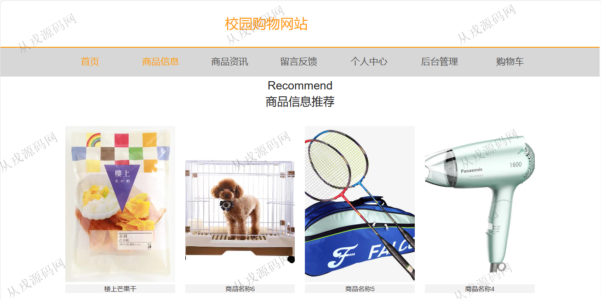
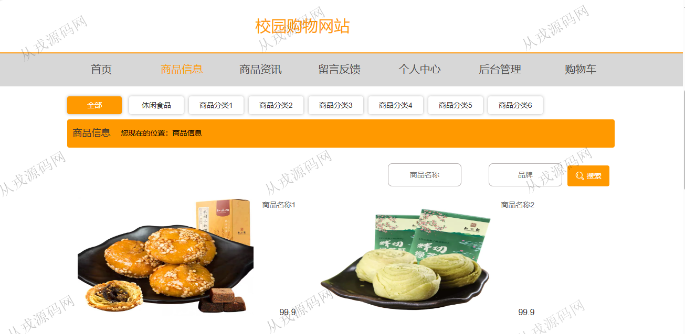
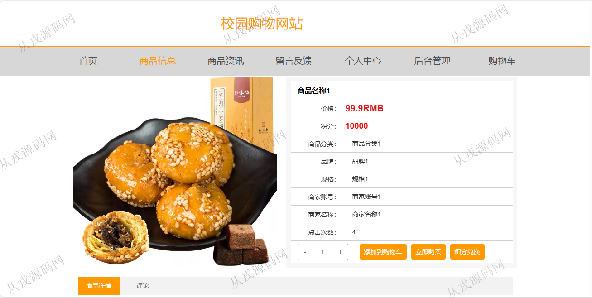
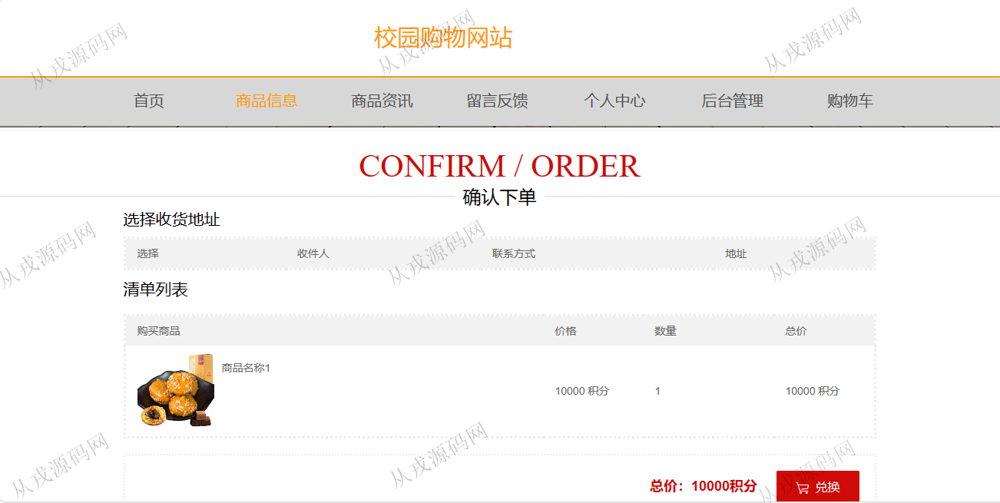
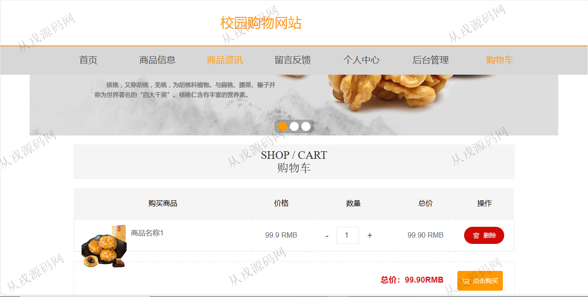
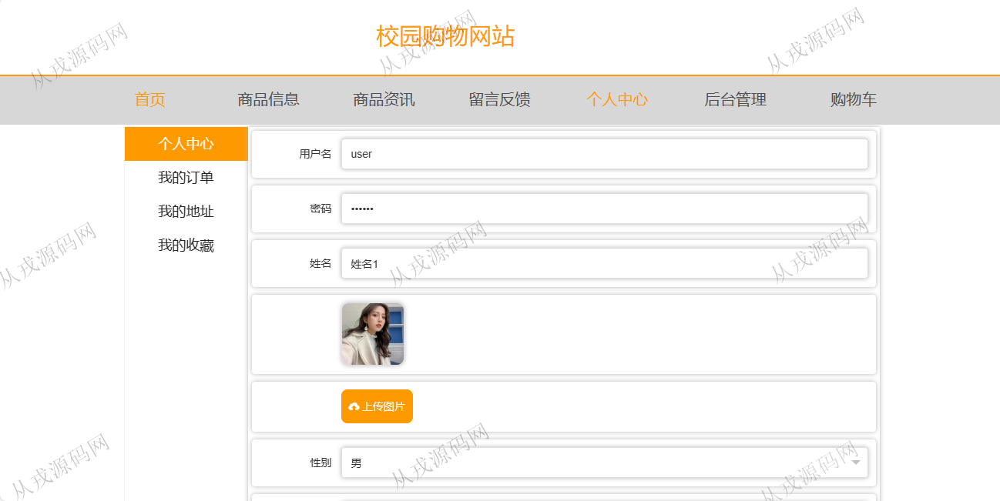
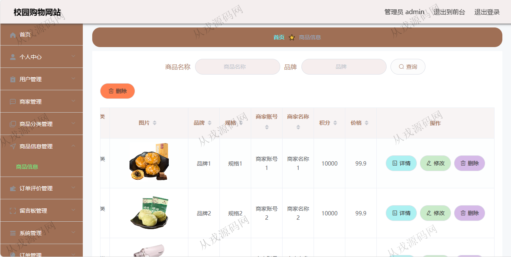
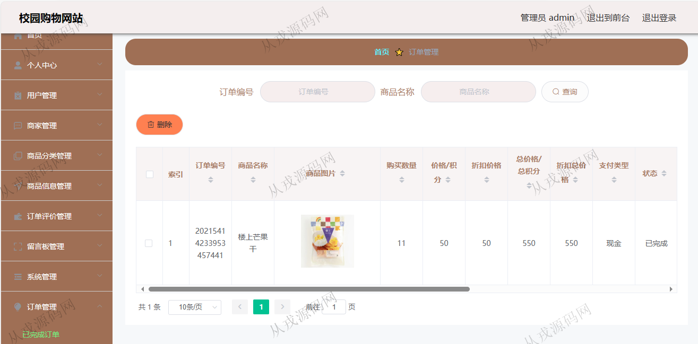

<h1 align="center">184.校园购物网站管理系统</h1>

 获取sql文件 QQ: 386869957 QQ群: 377586148 

 [更多源码项目: 从戎源码网](https://armycodes.com/) 

## 简介

> 本代码来源于网络,仅供学习参考使用!
>
> 提供1.远程部署/2.修改代码/3.设计文档指导/4.框架代码讲解等服务
> 
> 用户端访问地址：http://localhost:8080/ssm9g891/front/index.html
> 
> 用户：user 123456
> 
> 管理后台：http://localhost:8080/ssm9g891/admin/dist/index.html#/login
> 
> 管理员：admin 123456
> 

## 项目介绍
基于ssm+vue的校园购物网站管理系统：前端 vue、elementui，后端 maven、springmvc、spring、mybatis；角色分为管理员、用户；集成商品浏览、购物车、在线结算、订单查询等功能于一体的系统。

## 功能介绍

### 用户

- 基本功能：登录，注册，退出
- 网站首页：主导航栏，轮播图，商品搜索，商品信息推荐，商品资讯
- 商品购买：商品列表展示，按商品名称和品牌模糊搜索商品，商品详情，购物车，积分兑换，在线结算
- 其他功能：商品资讯，留言反馈
- 个人中心：个人信息查询与修改，密码修改，我的订单查询，我的地址维护，我的收藏列表，用户充值

### 管理员

- 用户管理：用户信息的增删改查，用户可以在用户端自行注册
- 商家管理：商家信息的增删改查
- 商品分类管理：分类信息的增删改查
- 商品信息管理：商品信息的增删改查，商品图片上传
- 订单评价管理：订单评价信息的列表查询，删除
- 留言板管理：用户在用户端发布的留言信息，管理员后台查看与回复
- 系统管理：轮播图信息的增删改查，商品资讯的增删改查
- 订单管理：订单的列表查询，发货操作

## 环境

- <b>IntelliJ IDEA 2021.3</b>

- <b>Mysql 5.7.26</b>

- <b>Tomcat 7.0.73</b>

- <b>Node 14.14.0</b>

- <b>JDK 1.8</b>

## 运行截图

